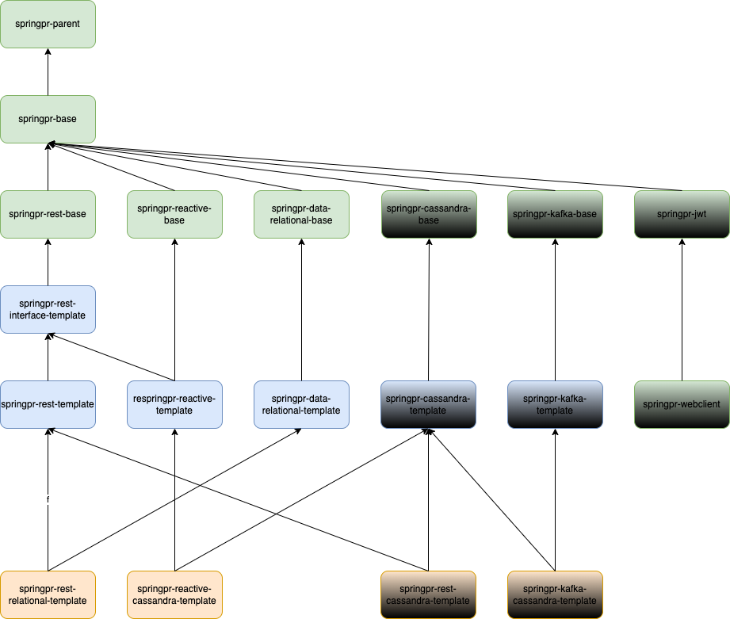
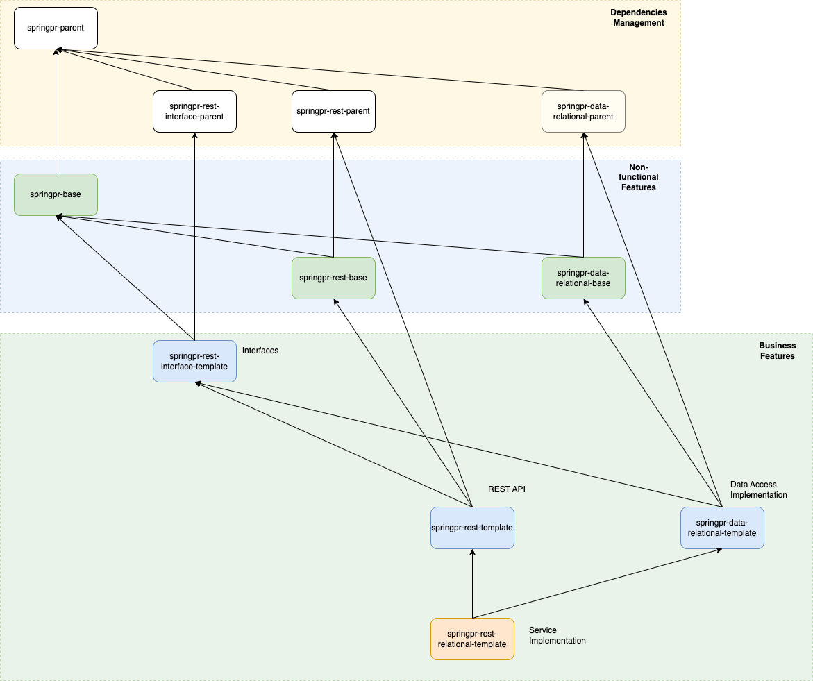

> README FILE

---

## Common Non-Functional Features for Spring Boot based Paved Road.

This project is a base module that provides common out-of-box non-functional features from Spring Boot.

### Build and Run Instructions

#### formatting code

under directory springpr-common

```
mvn spotless:apply
```

#### build the project as library that may be used in Maven as dependency

```
mvn -Plib clean install
```

#### Start application locally

change to directory springpr-common/springpr-common-exmaple

```
mvn -P'local,!lib' spring-boot:run
```

#### Checking the application

```
http://localhost:60000/springpr-common-example/welcome
```

---


### Out-of-box Features:

#### Dependencies and Configuration

- Spring Boot Based
- Automatic Dependencies Management - Spring Boot Dependencies
- [Externalized Configuration](externalized-configuration.md)
<br/><br/>

#### Observerbility

- Metrics gathering solution - Micrometer over Prometheus
- Distributed Tracing/Observerbility - Observability with Spring Boot 3
<br/><br/>

#### Production-Ready Feature: Application Monitoring

- Built in Production-Ready features - Spring Actuator
    - health statuses of application and important components
    - metrics (CPU, memory, threads, services etc.)
    - Displays current environment properties.
    - list of Spring Beans and Spring Boot conditions used
    - list of Spring Boot configured properties
    - git build information (build id, timestamps, etc)
    - Displays and modifies the configured loggers.
    - scheduled tasks in your application.
    - available default caches
    - mappings of available web endpoints
    - Dynamic adjustment of logging levels - Log4j over slf4j
<br/><br/>

#### REST API support

- REST endpoints - Spring MVC over Tomcat
- REST request validation and error handling
- REST Data Binding - JSON serialization/deserialization
- Pagination Support
- Automatic REST API documentation with OpenAPI 3.0 and Swagger UI - springdoc-openapi
- HATEOAS support
- CORS support
<br/><br/>

#### Common Programming Features

- Lombok integration
- Validations(Entity, service and web request parameter) - Spring Boot Validation
- Built in Retry/Circuit Breaker solutions - Spring Retry
- Default in-memory Caches - Cache with Spring/Caffeine
- Default thread pooling and management for asynchronous processing
- Scheduled Task Execution Support
- Application Events Support (publishing and listening)
    - Transaction Bound Events
    - Application Life-cycle Events
    - Custom Events
- Spring AOP
- Spring Expression Langurage (SpEL)
<br/><br/>

#### Security

- Password management - ePaaS Vault integration
<br/><br/>

#### Source Code Management

- Source code formatting and validation - spotless integration
- Automatic build information generation - git-commit-id-maven-plugin
<br/><br/>

#### Testing

- JUnit 4&5 integration
- Testing asynchronous systems - Awaitility integration
- Mocking framework - Mockito integration

---

### SpringPr - Structure of Modules



### SpringPr - Scope of frameworks




### Appendix

>
> Note the following files are included in the deployment artifact along with the code - these supply command line configuration for the application, i.e.
>

```
ARGS - contains the jar application arguments, those passed as args to your main method i.e. void main(String[] args)
```
```
JVMARGS - parameters to be passed directly to the jvm via the -D flag, e.g. -DmyEnv=xyz
```

Within the container, the application will be deployed in the opt/app-root/app.jar location and executed as:

```
/usr/bin/java -DmyOption=abc -jar /opt/app-root/app.jar args0 args1 ...
```

---

#### Application version convention

FEATURE.$INTERIM.$UPDATE.$PATCH

$FEATURE: counter will be based on feature release versions.

$INTERIM: counter will be incremented for non-feature releases that contain compatible bug fixes and enhancements but no incompatible changes. Usually, this will be zero, as there will be no interim release in a six month period. This kept for a future revision to the release model.

$UPDATE: counter will be incremented for compatible update releases that fix security issues, regressions, and bugs in newer features. This is updated one month after the feature release and every 3 months thereafter. The April 2018 release is JDK 10.0.1, the July release is JDK 10.0.2, and so forth

$PATCH: counter will be incremented for an emergency release to fix a critical issue.

## 🏆 Contributing

See [contributing guidelines](./CONTRIBUTING.md)

## Custodians

- **Lead Maintainer:** [Yang Li](mailto:yangli136@gmail.com)


# Importing Internal NonProd Root CA to trust store


Importing certificate into trust store:

```
keytool -import -alias CertaaSOnDemandNonProdIssuingCAII -file ./CertaaSOnDemandNonProdIssuingCAII.crt -keystore <keystore_path>
```
