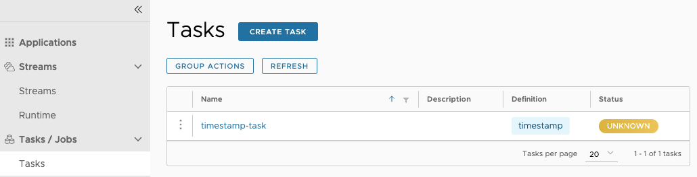
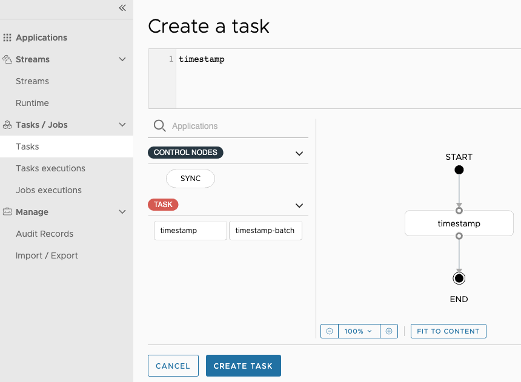

> README FILE

# Build A Sample Application of Batch Processing Paved Road based on Spring Batch
---


## Local Laptop Set up
---

Please check the following list and see if you had completed all the required local laptop setup steps.

### Cold Start

[Set up local laptop](https://github.springpr.org/pages/SpringPR-eng/SpringPRway/docs/paved-roads/getting-started/cold-start)

#### How to obtain temporary local admin privilege
[Self Service - Mac](https://github.springpr.org/pages/SpringPR-eng/SpringPRway/docs/paved-roads/getting-started/cold-start#self-service---mac)

#### Obtain Proxy Permission
[Access and Permissions](https://github.springpr.org/pages/SpringPR-eng/SpringPRway/docs/paved-roads/getting-started/cold-start#access-and-permissions)

#### Set up Proxy (Terminal and IDE)
[Proxy](https://github.springpr.org/pages/SpringPR-eng/SpringPRway/docs/paved-roads/getting-started/cold-start#proxy)

#### Xcode set up
[Xcode](https://github.springpr.org/pages/SpringPR-eng/SpringPRway/docs/paved-roads/getting-started/cold-start#xcode-command-line-tools)

#### Homwbrew set up
[Homebrew](https://github.springpr.org/pages/SpringPR-eng/SpringPRway/docs/paved-roads/getting-started/cold-start#homebrew)

#### GIT and Github Access
[GIT set up](https://github.springpr.org/pages/SpringPR-eng/SpringPRway/docs/paved-roads/getting-started/cold-start#git)

[Github access](https://github.springpr.org/pages/SpringPR-eng/SpringPRway/docs/paved-roads/getting-started/cold-start#github)

#### Docker
[Docker set up](https://github.springpr.org/pages/SpringPR-eng/SpringPRway/docs/paved-roads/getting-started/cold-start#docker)

#### IDE
[IDE Set up](https://github.springpr.org/pages/SpringPR-eng/SpringPRway/docs/paved-roads/getting-started/cold-start#ide)

## Required by Spring Batch
---

#### PostgreSQL
[PostgreSQL installation](https://www.postgresql.org/download/macosx/)

Get Postgres.app

or

Install with Homebrew

```
brew install postgresql@17
```

#### PostgreSQL SQL Query Tool - DBeaver
Go to _Self Service_ app, search and download DBeaver

Configure JDBC Driver
[How to download and install a PostgreSQL JDBC driver](https://dbeaver.com/docs/dbeaver/Database-drivers/)

Default property values for PostgreSQL JDBC Driver:

```
org.postgresql.Driver
jdbc:postgresql://{host}[:{port}]/[{database}]
5432
postgres
```

#### Java
[Java Install]( https://github.springpr.org/pages/SpringPR-eng/SpringPRway/docs/paved-roads/jvm/getting-started/development-environment)

Install Java 21 or 23

If you need multiple versions of Java, please consider to use jenv to manage them.

[jenv](https://github.com/jenv/jenv)

#### Maven
[Maven installation](https://maven.apache.org/install.html)

Install latest stable version (3.9.9)

**You need a Java Development Kit (JDK) installed. Either set the JAVA_HOME environment variable to the path of your JDK installation or have the java executable on your PATH.**

**Add the bin directory of the created directory apache-maven-3.9.9 to the PATH environment variable.**

Binary Distribution

or

Homebrew installation


## How to build sample application
---

### Import the sample application from Gitbub

[Spring Batch Paved Road Sample Application](https://github.springpr.org/yli25/springpr-batch)

This project is a template application that provides
1. common out-of-box non-functional features from Spring Boot.
2. Default Batch Processing supporting features

### Initial database set up

Start DBeaver and run the following to set up required schema: springpr and table: people

```
src/main/resources/schema_all.sql
```

change the following properties in src/main/resources/application_jpa.properties

from

```
spring.cloud.task.initialize-enabled=false
spring.batch.jdbc.initialize-schema=never
```

to

```
spring.cloud.task.initialize-enabled=true
spring.batch.jdbc.initialize-schema=always
```

**Please remember to roll back the changes after the first time run the application successfully.**

### Build and Run Instructions

#### formatting code

under top directory springpr-batch

```
mvn spotless:apply
```

#### build the project as library that may be used in Maven as dependency

```
mvn -Plib clean install
```

#### Start application locally

**configure and use a trust store with SpringPR self sign certificates.**
You can find one under springpr-batch/setup/cacerts_CertaaSOnDemandNonProdIssuingCAII
put it in a directory (e.g. ~/.java_certs/) then set up a system property: JAVA_CERTS

```
export JAVA_CERTS=~/.java_certs/cacerts_CertaaSOnDemandNonProdIssuingCAII
```

change to directory springpr-batch/springpr-batch-exmaple

```
mvn -P'local-postgres,!lib' spring-boot:run
```

#### Checking the application

```
http://localhost:60011/springpr-batch-example/welcome
```


## Spring Cloud Data Flow
---

## Local Manual Installation Guide - Spring Cloud Data Flow Server

#### Downloading PostgreSQL Database

##### Follow instructions here to install PostgreSQL database locally:
[Postgres.App Instructions](https://postgresapp.com/)

##### Follow instructions here to install pgAdmin 4 locally:
[PgAdmin Instructions](https://www.pgadmin.org/download/)

#### Downloading Data Flow Server and Shell

##### Server Download
```
https://repo.maven.apache.org/maven2/org/springframework/cloud/spring-cloud-dataflow-server/2.11.5/spring-cloud-dataflow-server-2.11.5.jar
```

##### Shell Download

```
https://repo.maven.apache.org/maven2/org/springframework/cloud/spring-cloud-dataflow-shell/2.11.5/spring-cloud-dataflow-shell-2.11.5.jar
```

#### Enable Task Feature Only

##### create springpr schema

```
CREATE SCHEMA IF NOT EXISTS springpr;

```

##### Set up the following environment variables in the terminal that is used to run Spring Cloud Data Flow Server

```
export SPRING_CLOUD_DATAFLOW_FEATURES_STREAMS_ENABLED=false
export SPRING_CLOUD_DATAFLOW_FEATURES_SCHEDULES_ENABLED=false
export SPRING_CLOUD_DATAFLOW_FEATURES_TASKS_ENABLED=true
export spring_datasource_url=jdbc:postgresql://localhost:5432/postgres?currentSchema=springpr
export spring_datasource_username=postgres
export spring_datasource_driverClassName=org.postgresql.Driver
```

#### Populate Spring Cloud Data Flow Schema - first time only

```
java -jar spring-cloud-dataflow-server-2.11.5.jar \
  --spring.datasource.url='jdbc:postgresql://localhost:5432/postgres?currentSchema=springpr' \
  --spring.datasource.username=postgres \
  --spring.datasource.driverClassName=org.postgresql.Driver \
  --spring.profiles.active=init-postgresql
```


#### Start Spring Cloud Data Flow Server

```
java -jar spring-cloud-dataflow-server-2.11.5.jar
```

#### Start Sprig Cloud Data Flow Shell

```
java -jar spring-cloud-dataflow-shell-2.11.5.jar
```

#### Access Server Dashboard

```
http://localhost:9393/dashboard/index.html#/apps
```

#### Downloading sample task applications

##### Downloading timestamp-task
[timestamp-task 3.1.0](https://repo.spring.io/artifactory/milestone/io/spring/timestamp-task/3.1.0/timestamp-task-3.1.0.jar)

##### Downloading timestamp-batch-task
[timestamp-batch-task 3.1.0](https://repo.spring.io/artifactory/milestone/io/spring/timestamp-batch-task/3.1.0/timestamp-batch-task-3.1.0.jar)

#### Registering sample task applications

##### Registering timestamp-task

```
dataflow:>app register --name timestamp-task --type task --uri file:///{YourfileLocation}/timestamp-task-3.1.0.jar
```

##### Registering timestamp-batch-task

```
dataflow:>app register --name timestamp-batch-task --type task --uri file:///{YourfileLocation}/timestamp-batch-task-3.1.0.jar
```
#### Creating Tasks

##### Create timestamp-batch-task

click CREATE TASK button



link the new task to application



the "Application" field should be timestamp-batch-task, the name defined in "app regiester ..." command.
then click "CREATE TASK" button at bottom of the page.

## Architecture

#### Spring Cloud Data Flow Architecture

##### Spring Cloud Data Flow Runtime Architecture with batch job


##### Spring Cloud Data Flow Runtime Architecture with composed task


## Appendix A - Common Issues ##

#### A job execution for this job is already running ####
**Error Message**

```
Caused by: org.springframework.batch.core.repository.JobExecutionAlreadyRunningException: A job execution for this job is already running: JobExecution: ...
```

**Solution**

```
Run purge-meta-tables.sql
```
