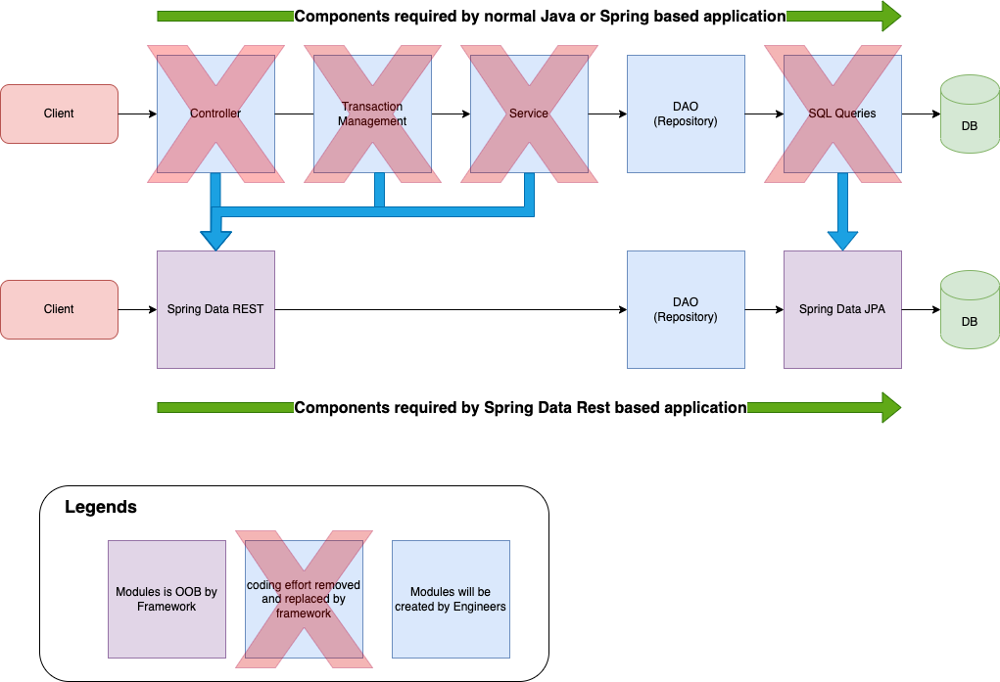

> README FILE

---

## REST Data API Template - Spring Boot based Paved Road.

This template project provides Domain Driven Design support and dynamically exposes REST API for underneath Data Store.

The solution assists engineers to focus on building domain models by following Amex Enterprise API strategy based on Domain Driven Design (DDD). From the domain models, the solution will dynamically generate enterprise-grade feature-rich (CRUD, HAL, Pagination etc.) REST API and database queries so that 80-90% coding and maintenance effort reduction could be reached.

The solution is Hydra-ready, and all required non-functional features (observability, resiliency, security etc.) are provided out-of-box.

PostgreSQL, Oracle and Cassandra are fully supported. Couchbase support will be available soon.

### Out-of-box Features:

#### Major Benefits

- Resource Exposure as REST API by framework dynamically
    - 80-90% coding and maintenance effort reduction
    - Consistent high code quality
    - Starting from a production-ready working template
- Hydra Ready (all CI/CD configuration included)
- Observability ready without code changes
    - OpenTelemetry Integrated (logs, traces, metrics)
- Resiliency
    - Automatic retries of recoverable errors
    - Data validation at all layers
    - Enterprise-grade error handling
- Scalability
    - scale automatically and individually with Hydra Horizontal POD autoscaler (HPA).
- Security
    - Vault integration
    - Hydra mTLS (Mutual TLS)
    - iDaas
- Multiple Deployment Modes in Hydra
    - Blue/Green Deployments
    - Canary Deployment’s
    - Rolling Deployments
- Performance
    - Java Virtual Threads support
- Built in support of Data Driven Design
    - Bounded Contexts
    - Entities
    - Value Objects
    - Aggregates
    - Domain Events
    - Services
    - Repositories
- Flexible on domain serivce granuality
    - single table
    - an aggregate of a set of tables with close relations
    - one to many
    - many to many
    - collections
- Extensive Customizability
    - Projection of fields in Entities
    - JSON to Object Mapping (Jackson annotations)
    - Object to Relational Mapping (JPA annotations)
- Centralized Dependency Management for simplified future upgrades

  

#### Major REST Data Services Features Out-of-box

- CRUD operations as Services
- Data Validation
- HAL as the Default (Explorable API)
- API Documentation automatically generated by OpenAPI integration
- Transaction as the default
- Search/Filtering API with QueryDsl support
- Pagination and Sorting and Dynamic Filtering
- SQL generated automatically
- CORS support
- Customization and Events

- Hikari connection pooling
- DAO Exception Hierarchy/Translation
- Support for PostgresSQL, Oracle and embedded H2

- TestContainers Support for unit tests and local development
  

#### Production-Ready Feature: Application Monitoring

- Built in Production-Ready features - Spring Actuator
    - health statuses of application and important components
    - metrics (CPU, memory, threads, services etc.)
    - Displays current environment properties.
    - list of Spring Beans and Spring Boot conditions used
    - list of Spring Boot configured properties
    - git build information (build id, timestamps, etc)
    - Displays and modifies the configured loggers.
    - scheduled tasks in your application.
    - available default caches
    - mappings of available web endpoints
    - Dynamic adjustment of logging levels - Log4j over slf4j
  

#### Source Code Management

- Source code formatting
- Project artifacts validation with enforcer
  

---
